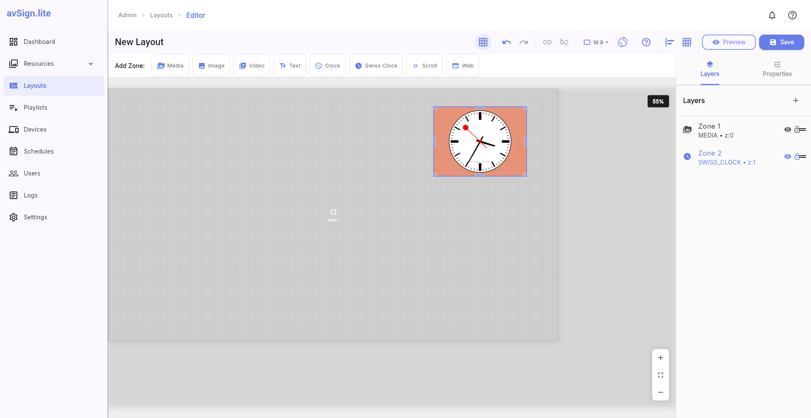
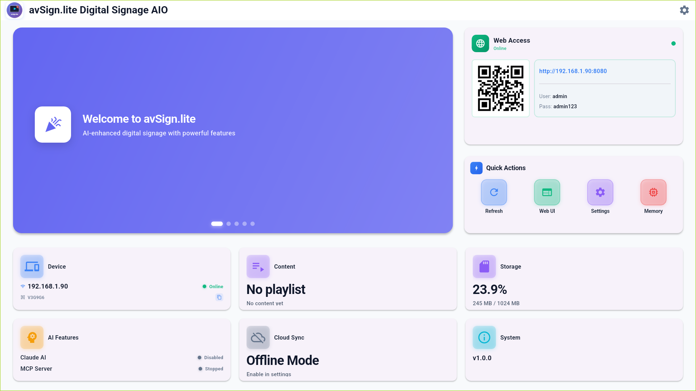
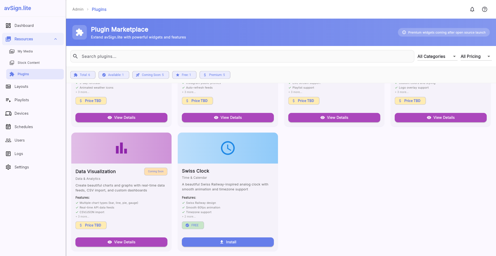

# avSign.lite

**AI-enhanced digital signage software for offline-first content management**

> ⚠️ **Phase 0 Beta**: This is a pre-release version with compiled binaries only.
> Source code will be released as open-source (AGPLv3) in Phase 1 (Q4 2025).

---

## 🚀 Quick Start

### Download Latest Release

**Version: v1.0.2 (Phase 0)** | [All Releases](https://github.com/sandriverfish/avsign-lite/releases)

| Platform | Download | Size | Requirements |
|----------|----------|------|--------------|
| 🪟 **Windows** | [Download ZIP](https://github.com/sandriverfish/avsign-lite/releases/download/v1.0.2/avsign-lite-1.0.2-windows-android.zip) | ~102 MB | Windows 10+ |
| 🤖 **Android** | [Download APK](https://github.com/sandriverfish/avsign-lite/releases/download/v1.0.2/avsign-lite-1.0.2-android.apk) | ~162 MB | Android 9+ |
| 🐧 **Linux** | _Coming Soon_ | - | Ubuntu 20.04+ |
**Linux will be available soon.**

### Installation

See our [Installation Guide](docs/Installation_Guide.md) for detailed platform-specific instructions.

**Quick links:**
- [Windows Installation](docs/Installation_Guide.md#windows)
- [Android Installation](docs/Installation_Guide.md#android)
- [Linux Installation](docs/Installation_Guide.md#linux)

---

## ✨ Features

### Core Digital Signage Capabilities

- 🖼️ **Resource Management** - Upload and organize images, videos, and media files
- 🎨 **Visual Layout Editor** - Drag-and-drop interface for creating custom layouts
- 📋 **Template Library** - Pre-built templates (full screen, PIP, quad dashboard, video wall, etc.)
- 🎬 **Playlist System** - Create and schedule content programs with multiple zones
- 📱 **Multi-Platform Support** - Runs on Windows, Android, and Linux
- 🔌 **Offline-First Architecture** - Works perfectly without internet connection
- 🖥️ **Device Management** - Manage multiple display terminals
- 🎯 **Content Publishing** - Push content to displays instantly

### Supported Media Types

- **Images**: JPG, PNG, GIF, BMP, WebP
- **Videos**: MP4, AVI, MKV, MOV, WebM
- **Text**: Dynamic text overlays, scrolling text, clocks
- **Layouts**: Multi-zone layouts with independent content per zone

---

## 📸 Screenshots

<table>
  <tr>
    <td width="50%">
      
      
<em>Main Dashboard - Resource Management</em>

    </td>
    <td width="50%">
      
      
<em>Visual Layout Editor</em>

    </td>
  </tr>
  <tr>
    <td width="50%">
      
      
<em>Client Dashboard Display</em>

    </td>
    <td width="50%">
      
      
<em>Settings & Configuration</em>

    </td>
  </tr>
</table>

---

## 📖 Documentation

**Getting Started:**
- [Quick Start Guide](docs/Quick_Start.md) - Get up and running in 5 minutes
- [User Guide](docs/User_Guide.md) - Complete usage documentation
- [Installation Guide](docs/Installation_Guide.md) - Platform-specific setup instructions

**Support & Help:**
- [Troubleshooting](docs/Troubleshooting.md) - Common issues and solutions
- [FAQ](docs/FAQ.md) - Frequently asked questions
- [Release Notes](CHANGELOG.md) - Version history and changes

---

## 🐛 Beta Testing & Feedback

We're currently in **Phase 0 Beta** and actively seeking feedback from users!

### How to Participate

1. **Download** the app for your platform (links above)
2. **Install** and test the core features
3. **Report bugs** using our [bug report template](https://github.com/sandriverfish/avsign-lite/issues/new?template=bug_report.yml)
4. **Request features** via our [feature request form](https://github.com/sandriverfish/avsign-lite/issues/new?template=feature_request.yml)

### Feedback Channels

- 🐛 **Bug Reports**: [GitHub Issues](https://github.com/sandriverfish/avsign-lite/issues)
- 💡 **Feature Requests**: [GitHub Issues](https://github.com/sandriverfish/avsign-lite/issues)
- 💬 **Discussions**: [GitHub Discussions](https://github.com/sandriverfish/avsign-lite/discussions)
- 💬 **Discord**: [@avsign.lite](https://discord.gg/EMh8zanC)
- 🐦 **Twitter/X**: [@sandriverfish](https://twitter.com/sandriverfish)
- 📧 **Email**: sandriverfish@gmail.com

### What We're Looking For

- Installation experience feedback
- Bug reports and crashes
- Feature requests and ideas
- Use case suggestions
- Documentation improvements

---

## 🗺️ Roadmap

### ✅ Phase 0: Beta Testing (Current - Nov 2025)

**Status**: Public beta with compiled binaries

- ✅ Core digital signage features
- ✅ Multi-platform support (Windows, Android, Linux)
- ✅ Resource and layout management
- ✅ Template library
- ✅ Public beta program

### ⏳ Phase 1: Open Source Launch (Q4 2025)

**Status**: Planned

- Full source code release under AGPLv3
- Developer documentation and contribution guidelines
- Community contributions enabled
- Enhanced documentation with architecture diagrams
- Public GitHub repository with full history

### ⏳ Phase 2: Advanced Features (Q1 2026)

**Status**: In development

- MCP server for AI agent control
- AI-powered content generation (Claude Skills)
- Cloud synchronization and backup
- Advanced scheduling system
- Multi-device management dashboard
- Analytics and reporting

---

## 📋 System Requirements

### Windows

- **OS**: Windows 10 or later (64-bit)
- **RAM**: 4 GB minimum, 8 GB recommended
- **Disk Space**: 500 MB
- **Display**: 1024x768 or higher resolution
- **Graphics**: DirectX 11 compatible graphics card

### Android

- **OS**: Android 9.0 (Pie) or later (recommended)
- **RAM**: 2 GB minimum, 4 GB recommended
- **Disk Space**: 200 MB
- **Display**: Tablet or phone with 720p+ resolution
- **Permissions**: No runtime external storage permission required (uses scoped app storage by default)

### Linux

- **OS**: Ubuntu 20.04 or later (or equivalent distribution)
- **RAM**: 4 GB minimum, 8 GB recommended
- **Disk Space**: 500 MB
- **Display**: 1024x768 or higher resolution
- **Dependencies**: GTK 3.0+, GLIBC 2.31+

---

## 🎯 Use Cases

avSign.lite is perfect for:

- 🏪 **Retail Stores** - Product promotions, digital menus, pricing displays
- 🍔 **Restaurants** - Menu boards, daily specials, promotional content
- 🏢 **Corporate Offices** - Lobby displays, meeting room schedules, announcements
- 🏫 **Educational Institutions** - Event calendars, wayfinding, announcements
- 🏥 **Healthcare Facilities** - Patient information, wayfinding, health tips
- 🎪 **Event Venues** - Event schedules, sponsor displays, information boards
- 🏠 **Smart Homes** - Family calendars, weather displays, photo frames

---

## 💬 Community

Join our growing community of digital signage users!

- **GitHub Discussions**: [Ask questions, share ideas](https://github.com/sandriverfish/avsign-lite/discussions)
- **Discord**: [Join our server](https://discord.gg/EMh8zanC)
- **Twitter/X**: [@sandriverfish](https://twitter.com/sandriverfish)
- **Email**: sandriverfish@gmail.com

---

## 📄 License

**Phase 0 Beta License**: The compiled binaries are provided for testing and evaluation purposes only. Commercial redistribution is not permitted during the beta phase.

**Phase 1 License (Coming Soon)**: The source code will be released under the GNU Affero General Public License v3.0 (AGPLv3), ensuring the software remains free and open-source.

See [LICENSE](LICENSE) for complete beta license terms.

---

## 🙏 Acknowledgments

- **Based on**: [EasyDisplayClient](https://github.com/EasyDisplayClient) v1.0.2+6
- **Built with**: [Flutter](https://flutter.dev/) - Cross-platform UI framework
- **Media Playback**: [media_kit](https://github.com/media-kit/media-kit)
- **Database**: [Drift](https://drift.simonbinder.eu/) - Type-safe SQLite for Dart

---

## 🤝 Contributing

**Phase 0 Note**: We're not accepting code contributions during the beta phase since source code isn't publicly available yet.

**You can help by**:
- Testing the software and reporting bugs
- Suggesting features and improvements
- Improving documentation (typos, clarity)
- Sharing your use cases and feedback

**Phase 1 Note**: Once we open-source the code, we'll provide full contribution guidelines in `CONTRIBUTING.md`.

---

## 📞 Contact & Support

### Beta Support

- **Email**: sandriverfish@gmail.com
- **Response Time**: Within 48 hours (weekdays)
- **GitHub Issues**: [Report bugs or request features](https://github.com/sandriverfish/avsign-lite/issues)

### General Inquiries

- **Website**: *(coming soon)*
- **Email**: sandriverfish@gmail.com
- **Discord**: [@avsign.lite](https://discord.gg/EMh8zanC)
- **Twitter/X**: [@sandriverfish](https://twitter.com/sandriverfish)

---

## 📊 Project Status

**Current Version**: v1.0.2 (Phase 0)
**Phase**: 0 (Beta Testing)
**Status**: Active Development
**Next Milestone**: Phase 1 Open Source Launch (Q4 2025)

### Quick Stats

- **Platforms Supported**: 3 (Windows, Android, Linux)
- **Active Beta Testers**: TBD
- **Issues Resolved**: TBD
- **Features**: 20+ core features

---

## ⭐ Support the Project

If you find avSign.lite useful:

- ⭐ **Star this repository** to show your support
- 🐛 **Report bugs** to help us improve
- 💡 **Share feature ideas** to shape the roadmap
- 📢 **Spread the word** to others who might benefit
- 📝 **Write about your experience** (blog posts, reviews)

---

## 🔐 Security

If you discover a security vulnerability, please email sandriverfish@gmail.com instead of using the public issue tracker. We'll respond within 48 hours.

---

**Made with ❤️ for the digital signage community**

[Download](https://github.com/sandriverfish/avsign-lite/releases) • [Documentation](docs/) • [Report Bug](https://github.com/sandriverfish/avsign-lite/issues) • [Request Feature](https://github.com/sandriverfish/avsign-lite/issues)

